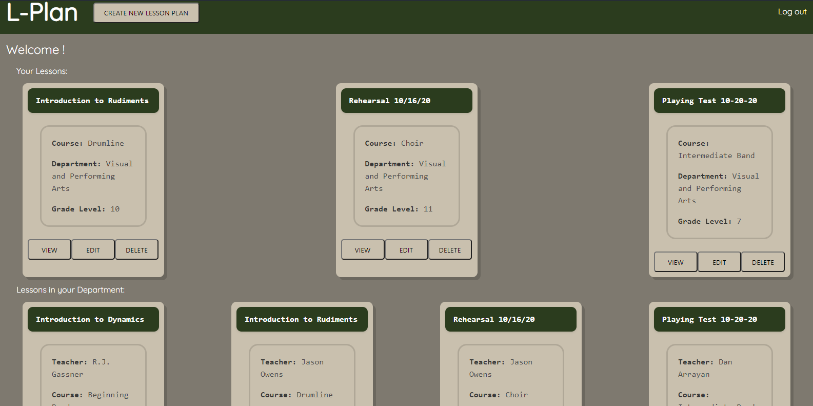

# Lesson_Planner

##Introduction

L-Plan is a platform that seeks to aid teachers with one of their most important, and sometimes most frustrating tasks: Lesson Planning! 
This app will allow teachers to do what they do best: create dynamic lessons for their students, without worrying about conforming to a district’s specific lesson plan format on their own. 
Teachers will input the necessary information for their lesson plans, and this app will automatically generate a lesson plan that includes all their information, and is formatted to district, county, and/or state required formatting. 
The app will also allow teachers to view the lesson plan's of other teachers, which can be useful to help standardize a curriculum, or help newer teachers hone their craft.

##User Story:
As a school administrator I want a platform that allows for the creation of lesson plans in a standardized format. 
I also want the ability for teachers to share their lesson plans with other teachers, as well as administrators. 

##Technological Outline:
This is a MERN application. 
That is to say that the user interface will be rendered in with React, and data (i.e. lesson plans) will be sent to a Mongo database via a node/express server. 
Other technologies to be used include, but are not limited to the mongoose ORM platform, react-router, and node libraries such as moment and path. 
The CSS library is Bulma.

##Division of Labor:
Two main approaches were used in the construction of this app. 
Scott and Joe had general responsibility for server-side code, including the Express server and Mongo Database, while Matt and R.J. were generally responsible for client-side work and React.
That being said, the four often came together to work on elements of the code from multiple angles.
A flexible approach was taken that saw team members work individually, in pairs, and as mentioned, in one large group.

##Conclusion
Teachers today face more challenges than ever before, and these challenges have only been compounded by the current global health crisis. 
Teachers play a vital role in our society, yet far too many of them are not being given the support they need. 
Due to this lack of support, far too many great teachers end up leaving the profession, creating teacher shortages, and resulting in the standards teachers are held to being lowered in order to fill the ever increasing amount of open positions. 
While this application will in no way solve all of the issues facing teachers, our hope is that in some small way, this application will allow those who nurture future generations to find at least one small part of their job a bit easier. 

##Deployment
This app [is deployed via Heroku and Mongo Atlas](https://sheltered-hollows-22179.herokuapp.com)

